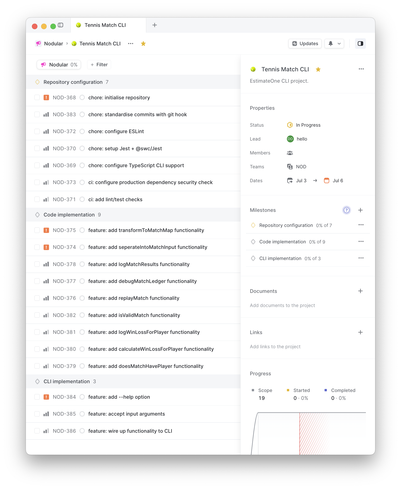
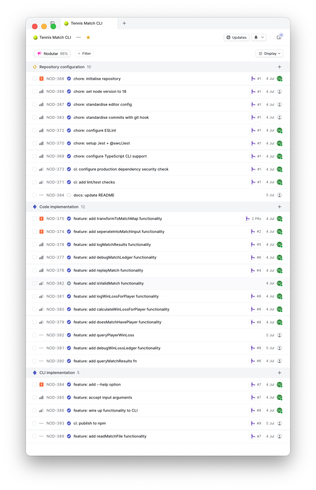
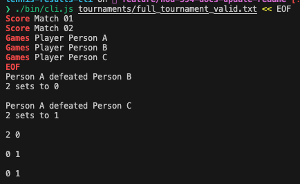
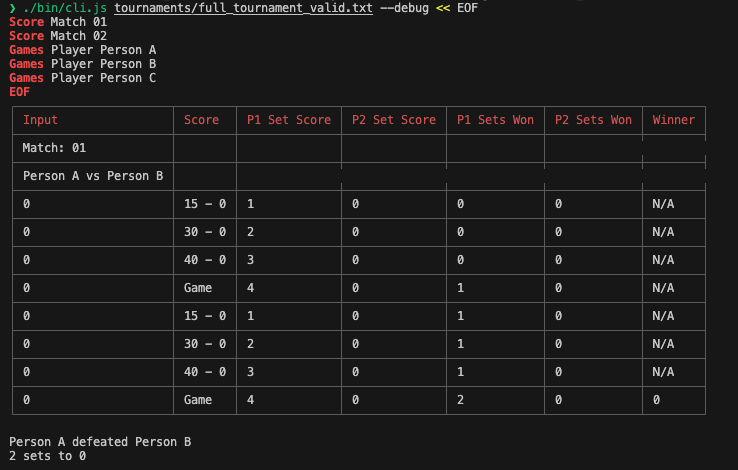
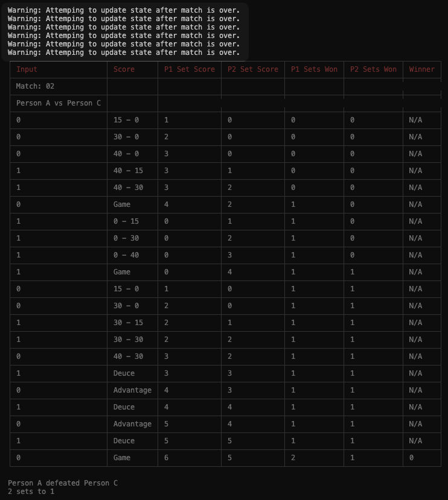
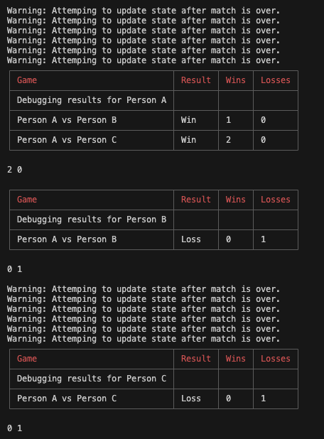

# Tennis Results CLI

## Quickstart

```s
# Install dependencies
$ yarn install

# Run application in dev mode
$ yarn dev

# Alternatively, run the application with debugging enabled
$ yarn dev --debug

# Run tests
$ yarn test

# Publish locally
$ yarn deploy

# Build package
$ yarn build

# Run built package
$  ./bin/cli.js

# Install from npm and run
$ npm i -g @okeeffed/tennis-results-cli
$ tennis-results-cli
```

## Important notes

For this project, I focused mainly on demonstrating my process than the actual code implementation. My process:

1. [Write a technical doc on Notion](https://paint-lemon-15f.notion.site/Technical-Design-Doc-fd0c41e35dc1459a97c38130e2acd47e?pvs=4).
2. Add tasks to Linear project comprised of three milestones (see images below).
3. Relied on my standard pull requests flow to demonstrate the process of getting from start to finish. See the repos [closed PRs](https://github.com/okeeffed/tennis-results-cli/pulls?q=is%3Apr+is%3Aclosed).
4. Configure GitHub Actions to help enforce routine inspections. See the repos [workflow runs](https://github.com/okeeffed/tennis-results-cli/actions).
5. Enforced Node 18 TypeScript standards.
6. Enforced recommended lint standards (with one ignored rule for a refactor).
7. Enforced deduping packages, CVE security and git commit conventions with git hooks.
8. Published to NPM through GitHub Actions.
9. Debugging for some understanding was added under the `--debug` flag but is non-exhaustive.







### Some noted improvements to this project

- GitHub actions on CI isn't using the caching correctly. I deemed it out of scope.
- I was a little confused by the provided example where games went on longer than possible (more 0s and 1s than the game length). The README noted that we need to handle empty lines, but it mentions nothing about extra scores. I may have misinterpreted the task here. Initially, I raised an error for an invalid state, but given that was the example input I changed course to effectively "halt" the game at the correct point. If you run in debug mode, it will let you know when state has been omitted because the game it complete. I committed my examples under `tournaments/` for this reason.
- This implementation assumes a lot of "valid" input (at least valid to what I grokked of the task). I raise errors on other invalid scenarios e.g. attempting to calculate results before the incomplete game etc. Normally I would clarify this further with the person in charge of outcomes.
- I added standard config as a base for this example (since I initialized the repo for empty), but I did not extend some of the configuration to what I normally would (e.g. enforcing import rules etc.). I deemed this out of scope.
- A lot of code implementation was TDD and then brute-force implementation. For the sake of timing, I did not look for alternative implementations and pressed forward with the initial approaches when pivots were required.
- Publishing to NPM requires manually bumping the version. This could also be changed with the help of other libraries.

Other notes:

- `yarn dev` uses Nodemon, so it does not pipe things in correctly. To work around this, I use a dev flag to run the defaults.

## Debugging

Enabling debug mode will add some tables to demonstrate the flow of the calculations. They were inspired by the initial README.



I also log warnings when the scores seemed to go longer than the game in debug mode. As noted above, I did not grok the requirement for that one.



Lastly, debugging also shows some information on how I calculated the win-loss.



## Publishing

The package should publish in CI to the NPM registry under [@okeeffed/tennis-results-cli](https://www.npmjs.com/package/@okeeffed/tennis-results-cli).

`npm i -g @okeeffed/tennis-results-cli` should install the package, then, assuming you have a valid file at `tournaments/full_tournament_valid.txt`, you can run:

```s
$ tennis-results-cli tournaments/full_tournament_valid.txt << EOF
Score Match 01
Score Match 02
Games Player Player A
Games Player Player B
Games Player Player C
EOF
```

## Resources

- [Technical Design Doc: Notion](https://paint-lemon-15f.notion.site/Technical-Design-Doc-fd0c41e35dc1459a97c38130e2acd47e?pvs=4)
- [Closed PRs](https://github.com/okeeffed/tennis-results-cli/pulls?q=is%3Apr+is%3Aclosed)
- [GitHub Actions: workflow runs](https://github.com/okeeffed/tennis-results-cli/actions)
- [NPM registry: @okeeffed/tennis-results-cli](https://www.npmjs.com/package/@okeeffed/tennis-results-cli)
